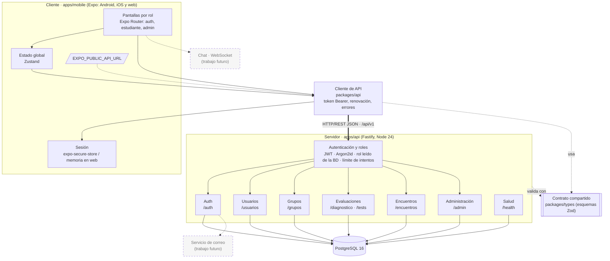

# Diagrama de componentes (versión 2)

Agrega respecto de la versión 1 del anexo: el componente Autenticación y roles, el contrato compartido `packages/types` usado por cliente y servidor, la variable `EXPO_PUBLIC_API_URL`, el módulo de encuentros y administración, y el chat y el servicio de correo como trabajo futuro (líneas punteadas).

