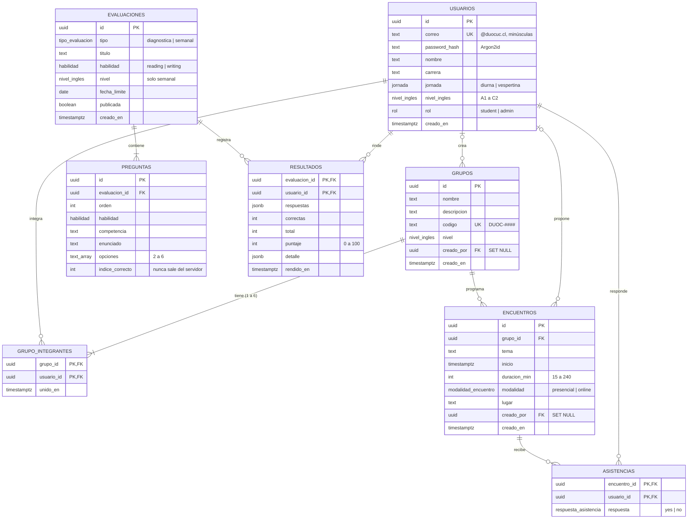

# Modelo entidad-relación

Fuente: `apps/api/db/schema.sql` (PostgreSQL 16). Las claves primarias compuestas (PK,FK) impiden duplicados: un estudiante no puede estar dos veces en un grupo, rendir dos veces la misma evaluación ni responder dos veces un encuentro.

